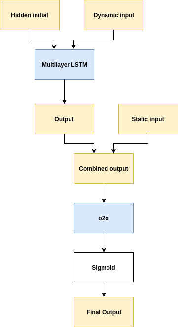

# ASSISTments Data Mining Competition 2017 - Optional Semester Project

#### Author: Dario Anongba Varela
#### Supervisor: Louis Faucon
#### Affilitation - Professor: EPFL CHILI Lab - Pierre Dillenbourg

## Abstract

Demand for qualified workers in science, technology, engineering, and mathematics (STEM) fields is ever increasing. Researchers are willing to identify the factors that make a student choose a STEM career over a non-STEM career as early as middle school. In this paper, we discuss a neural network model that has the ability to predict, given click-stream data from middle-school mathematics ASSISTments assignments, if a student will take a STEM career or not after college. With data from 467 college students, we developed a model that can successfully distinguish 87% of the time if a student will choose a STEM career. With this model, we provide educators with a way of identifying interest or disinterest in STEM from their students. 

## Dataset (in Data folder)

The data is composed of extensive (but carefully deidentified) click-stream data from middle school ASSISTments (an online learning platform) use, as well as carefully curated data on first job out of college.

The data is composed of 12 files:    

- *student_log_#.csv* (9 files), which contain the logged activity data from students' interactions with assistments ASSISTments
- *training_label.csv*, which contains some student-level data and the dependent measure for the training set: isSTEM.
- *validation_test_label.csv* contains some student-level data but not the dependent measure for the validation and test set

Description of columns : [here](https://docs.google.com/spreadsheets/d/1QVUStXiRerWbH1X0P11rJ5IsuU2Xutu60D1SjpmTMlk/edit#gid=0)

## Files

The implementation can either be seen in a jupyter notebook or plain old python files.   

- *Data_Preprocessing*: Does the data preprocessing on the features in order to transform them in usable data for the network.
- *Report_RNN*: Model implementation. Creates the model, trains it and saves the results in the `Results` folder.
- *Results*: Visualization of the results.

## Model used

The model used is described in the illustration below:

## License

TODO
